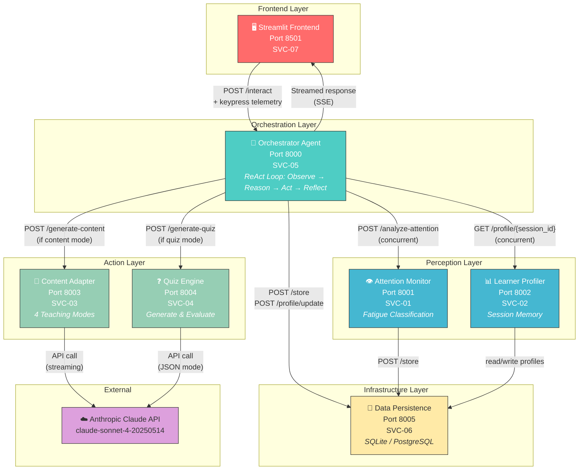
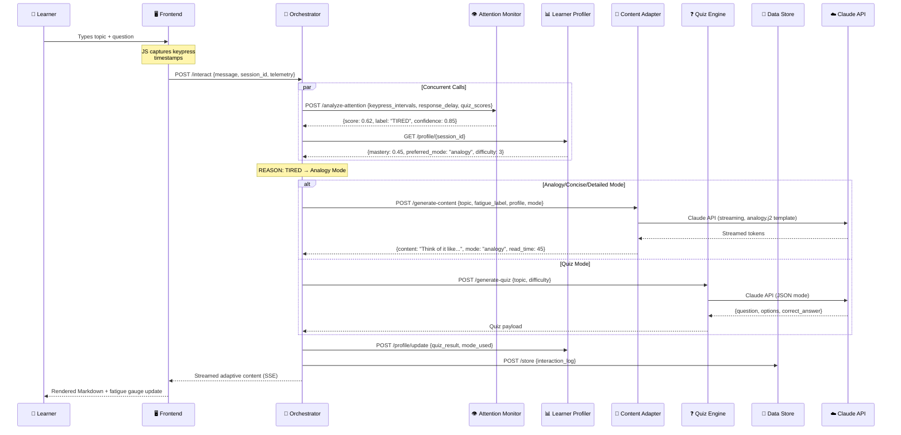
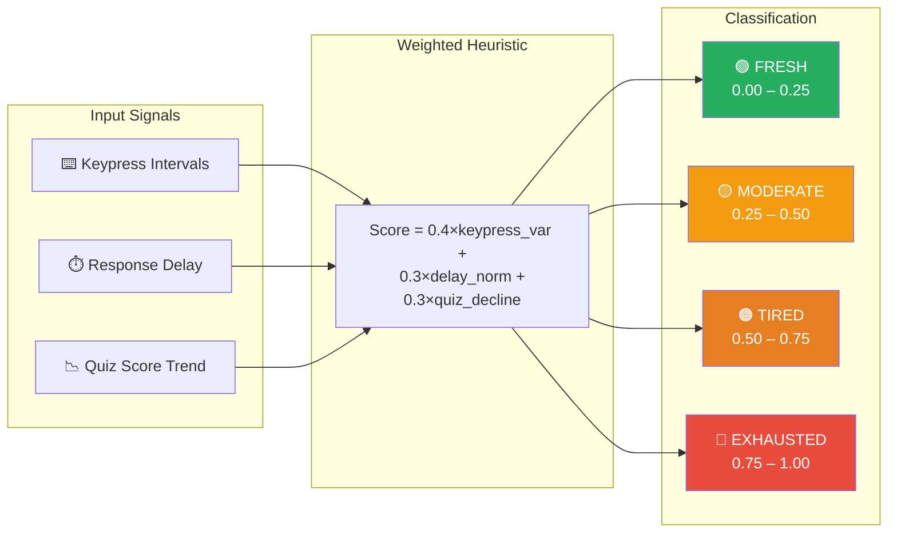

# Attention-Aware Study Assistant — Architecture Diagram
# 
# This file contains a Mermaid diagram of the system architecture.
# Render it at: https://mermaid.live or in any Markdown viewer that supports Mermaid.
#
# Alternatively, open this in Excalidraw and trace over it for a polished hand-drawn look.

## Data Flow — Single Interaction Cycle

## Fatigue Classification Logic

